 <!-- ── ANIMATED HEADER SVG ── -->    <!-- ── TYPING ANIMATION ── --> 

  

<!-- ── NAV LINKS ── -->

<a href="#-about">About</a> ·  <a href="#%EF%B8%8F-what-i-build">What I Build</a> ·  <a href="#-currently-exploring">Exploring</a> ·  <a href="#-featured-project">WaterPaid</a> ·  <a href="#-github">GitHub</a> ·  <a href="#-beyond-code">Beyond Code</a>

      <!-- ───────────────────────────────────────────────────────── §01 ABOUT ───────────────────────────────────────────────────────── -->
✦ About

I'm Raïssa, a Computer Engineering student at Yaoundé, Cameroon.
I don't like being limited to one box.
My work lives at the intersection of software engineering, IoT systems, cloud computing and applied AI — always driven by one question:
What real problem can this technology solve?
I build things that matter. Not just to graduate — but because I believe technology can transform Africa.

     <!-- ───────────────────────────────────────────────────────── §02 WHAT I BUILD ───────────────────────────────────────────────────────── -->
⚙️ What I Build

                     ┌─ SOFTWARE ──── NETWORKS ─── IoT ─┐
                     │                                   │
 UNDERSTAND PROBLEM ──▶  DESIGN SYSTEM  ──▶  BUILD  ──▶  IMPACT
                     │                                   │
                     └─── AI ─────── CLOUD ─── SECURITY ─┘
	

   

Domain	Focus
🏗️ Software Architecture	Hexagonal, microservices, clean systems
📡 IoT & Embedded Systems	LoRaWAN, Arduino, edge computing
☁️ Cloud & DevOps	Distributed systems, containers, pipelines
🌐 Web & Backend	Full-stack, REST APIs, real-time systems
🤖 Applied AI	Generative AI integration, ML basics
🔐 Cybersecurity & Networks	Cisco, routing, system hardening

      <!-- ───────────────────────────────────────────────────────── §03 CURRENTLY EXPLORING ───────────────────────────────────────────────────────── -->
🔭 Currently Exploring

Afficher l'image Afficher l'image Afficher l'image Afficher l'image Afficher l'image Afficher l'image Afficher l'image

The goal is never just more technologies. The goal is to understand how to build better systems.

     <!-- ───────────────────────────────────────────────────────── §04 TECHNICAL SKILLS ───────────────────────────────────────────────────────── -->
⚡ Technical World

Languages

  

Web & Backend

  

Data & Infrastructure

  

IoT & Embedded

  &nbsp; <code>LoRaWAN</code> &nbsp; <code>ChirpStack</code> &nbsp; <code>RAK3172</code> &nbsp; <code>MQTT</code> 
      <!-- ───────────────────────────────────────────────────────── §05 FEATURED PROJECT — WATERPAID ───────────────────────────────────────────────────────── -->
<!-- ───────────────────────────────────────────────────────── §06 GITHUB STATS ───────────────────────────────────────────────────────── -->
📊 GitHub

  &nbsp;&nbsp;  
 
  
      <!-- ───────────────────────────────────────────────────────── §07 BEYOND CODE ───────────────────────────────────────────────────────── -->
<!-- ───────────────────────────────────────────────────────── §08 MINDSET ───────────────────────────────────────────────────────── -->
🌱 Mindset

     Learn        ──▶        Build        ──▶        Ship
       ↑                                               ↓
       └──────────── Reflect  ◀──  Fail  ◀── Iterate ─┘

I'm still learning. I'm still experimenting. I'm still figuring out what kind of engineer I want to become.

And that's exactly what makes the journey interesting.

     <!-- ───────────────────────────────────────────────────────── FOOTER ───────────────────────────────────────────────────────── --> 
     &nbsp;  &nbsp; 

  

 <code>Computer Engineering Student · Yaoundé, Cameroun 🇨🇲</code>  

